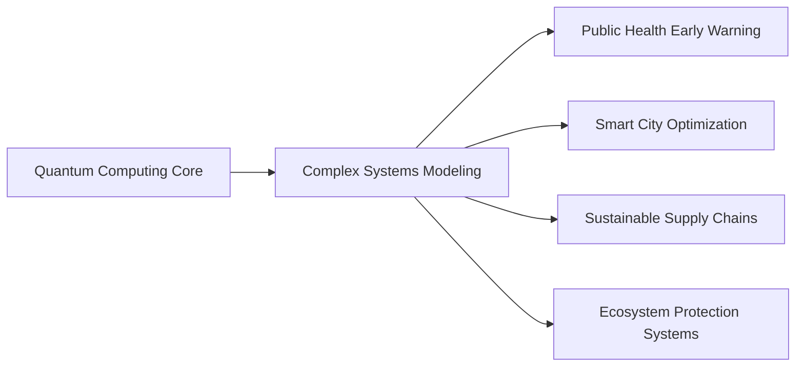
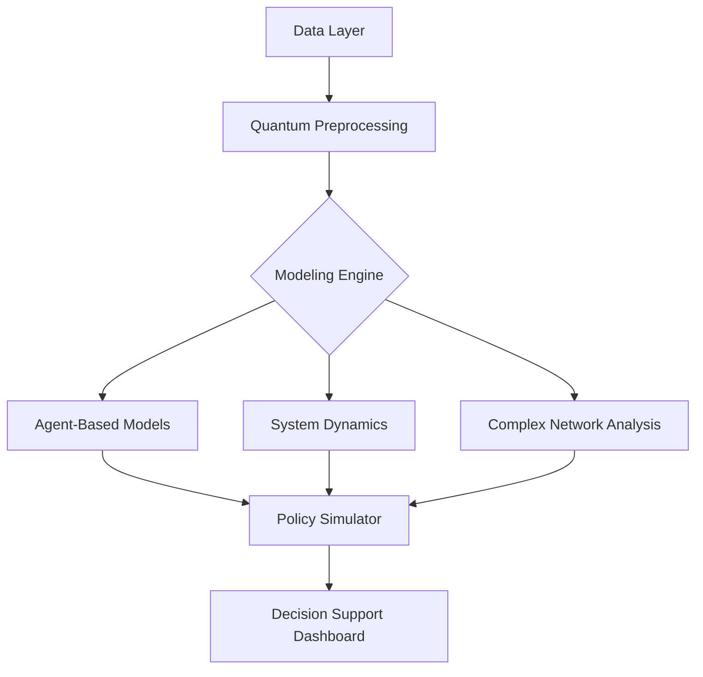

# Nexus Dynamics Global - Complex Systems Modeling Project Portfolio

  
**Quantum-Powered · Systems Innovation · Global Impact**

## Project Overview
Nexus Dynamics Global specializes in cutting-edge complex systems modeling technologies. Through quantum computing, multi-agent simulation, and AI optimization, we tackle global cross-domain challenges. This repository contains core modeling frameworks and demonstration applications, driving the transition from theory to policy implementation.



## Featured Projects

### 1. QuantumEcoForecast - Ecological Quantum Alert System
**Tech Stack**: Qiskit + GeoPandas + YOLOv8  
**Focus**: Biodiversity conservation and illegal activity monitoring  
```python
# Quantum-enhanced species distribution prediction
from qiskit_machine_learning.algorithms import QSVC
eco_qsvc = QSVC(quantum_kernel=QuantumKernel(feature_map=NatureFeatureMap()))
eco_qsvc.fit(species_data, habitat_labels)
```

[Explore Project](./QuantumEcoForecast) | [Preprint Paper](https://arxiv.org/abs/xxxx.xxxxx)

### 2. PandemicNavigator - Epidemic Spread Modeling Framework
**Breakthrough Innovations**:
- Multi-scale transmission network optimization using quantum annealing
- Real-time intervention simulation based on mobility data

**Policy Impact Cases**:
| Region | Intervention | Expected Infection Reduction |
|--------|--------------|-------------------------------|
| Kenya | Targeted Vaccination | 38% |
| Peru | Dynamic Lockdown Strategy | 52% |

[Explore Model](./PandemicNavigator)

### 3. UrbanFlowSynergy - Urban Systems Dynamics Sandbox
**Visual Demo**:  


**Core Features**:
- Infrastructure resilience stress testing
- Cascading effect analysis of policy interventions
- Energy-transportation-communication coupled modeling

[Live Demo](https://demo.nexus-dynamics.global/urban) | [API Documentation](./UrbanFlowSynergy/docs)

## Quick Start

### Install Dependencies
```bash
conda create -n nexus python=3.10
conda activate nexus
pip install -r requirements.txt
```

### Run Malaria Early Warning Example
```bash
python examples/malaria_early_warning.py \
  --quantum_backend ibmq_lima \
  --epidemiological_data ./data/africa_2023.csv
```

### Sample Output
```csv
Region, Risk_Score, Recommended_Intervention
Nairobi, 0.87, Vector_Control+Mobile_Clinics
Kisumu, 0.92, Emergency_Vaccination
```

## Technical Architecture


## Contribution Guidelines
We encourage interdisciplinary contributions:
1. **Modeling Experts**: Expand model library (see `model_contribution.md`)
2. **Developers**: Optimize quantum-classical hybrid computing interfaces
3. **Domain Experts**: Validate scenario datasets (healthcare/urban/ecology)

**Key Branches**:
- `main`: Stable production version
- `quantum-dev`: Quantum algorithm experiments
- `policy-integration`: Government application adaptations

## License
Core framework uses **MIT License**. 

---
> "Connecting complexity, Powering Progress" — Project Motto  
> **Join Us**: nexusdynamicsglobal@gmail.com| [Discord Community](https://discord.gg/MqSrkPPJ)
