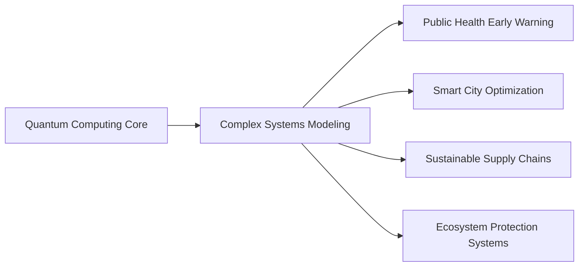
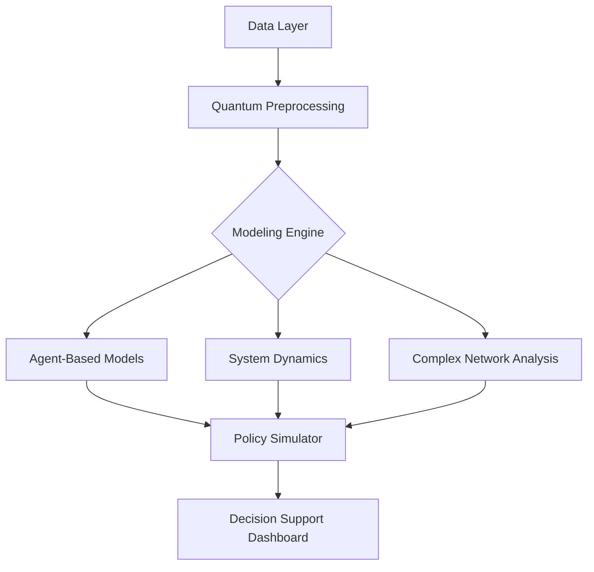

# Nexus Dynamics Global - Complex Systems Modeling Project Portfolio

  
**Quantum-Powered · Systems Innovation · Global Impact**

## Project Overview
Nexus Dynamics Global specializes in cutting-edge complex systems modeling technologies. Through quantum computing, multi-agent simulation, and AI optimization, we tackle global cross-domain challenges. This repository contains core modeling frameworks and demonstration applications, driving the transition from theory to policy implementation.

Nexus Dynamics Global se especializa en tecnologías de vanguardia para el modelado de sistemas complejos. Mediante la computación cuántica, la simulación multiagente y la optimización con IA, abordamos desafíos globales interdisciplinarios. Este repositorio contiene marcos de modelado fundamentales y aplicaciones de demostración, que impulsan la transición de la teoría a la implementación de políticas.

A Nexus Dynamics Global é especializada em tecnologias de ponta para modelagem de sistemas complexos. Por meio de computação quântica, simulação multiagente e otimização de IA, enfrentamos desafios globais entre domínios. Este repositório contém estruturas de modelagem essenciais e aplicações de demonstração, impulsionando a transição da teoria para a implementação de políticas.

Nexus Dynamics Global inataalam katika teknolojia ya kisasa ya uundaji wa mifumo changamano. Kupitia kompyuta ya kiasi, uigaji wa mawakala wengi, na uboreshaji wa AI, tunakabiliana na changamoto za kimataifa za vikoa. Hazina hii ina mifumo msingi ya kielelezo na maombi ya maonyesho, inayoendesha mageuzi kutoka kwa nadharia hadi utekelezaji wa sera.




## Featured Projects
# Sustainable Development Project Explorer


An interactive dashboard that allows users to explore 9,135+ potential development projects across Africa, Latin America, and the Caribbean, organized by country and domain.

[](https://your-demo-link.com)
[](LICENSE)

## Features

- **Regional Filtering**: Explore projects across 3 regions
  - Africa (54 countries)
  - Latin America (20 countries)
  - Caribbean (13 countries)
- **Domain Selection**: 8 development domains
  - Water Management
  - Health Systems
  - Infrastructure
  - Disaster Management
  - Environment
  - Agriculture
  - Energy
  - Urbanization
- **Modeling Methods**: 7 analytical approaches
  - System Dynamics
  - Agent-Based Modeling
  - Geospatial Analysis
  - Network Analysis
  - Machine Learning
  - Stochastic Modeling
- **Interactive Project Cards**: Dynamically generated project ideas with details
- **Responsive Design**: Works on mobile, tablet, and desktop devices

## How It Works

1. **Select a region** (Africa, Latin America, or Caribbean)
2. **Choose countries** from the selected region
3. **Pick domains** of interest
4. **Select modeling methods**
5. **Generate project ideas** tailored to your selections
6. **Explore details** of each project concept

## Data Structure

The application uses the following data organization:

### Regions and Countries
```json
{
  "africa": {
    "name": "Africa",
    "countries": ["Algeria", "Angola", ...]
  },
  "latinAmerica": {
    "name": "Latin America",
    "countries": ["Argentina", "Bolivia", ...]
  },
  "caribbean": {
    "name": "Caribbean",
    "countries": ["Antigua and Barbuda", "Bahamas", ...]
  }
}
```

### Project Templates
```javascript
const projectTemplates = {
  "Water Management": [
    "Integrated water resource management in {country}",
    "Smart irrigation systems for {country}'s agricultural sector",
    ...
  ],
  "Health Systems": [
    "Disease surveillance system for {country}",
    "Telemedicine infrastructure for rural {country}",
    ...
  ],
  // Other domains...
};
```

## Getting Started

To run this project locally:

1. Clone the repository:
```bash
git clone https://github.com/your-username/project-explorer.git
```

2. Open the HTML file in your browser:
```bash
cd project-explorer
open index.html
```

## Screenshots

| Region Selection | Country Selection | Project Results |
|------------------|-------------------|-----------------|
|  |  |  |

## Contributing

Contributions are welcome! Please follow these steps:

1. Fork the project
2. Create your feature branch (`git checkout -b feature/AmazingFeature`)
3. Commit your changes (`git commit -m 'Add some AmazingFeature'`)
4. Push to the branch (`git push origin feature/AmazingFeature`)
5. Open a pull 
### 1. QuantumEcoForecast - Ecological Quantum Alert System
**Tech Stack**: Qiskit + GeoPandas + YOLOv8  
**Focus**: Biodiversity conservation and illegal activity monitoring  
```python
# Quantum-enhanced species distribution prediction
from qiskit_machine_learning.algorithms import QSVC
eco_qsvc = QSVC(quantum_kernel=QuantumKernel(feature_map=NatureFeatureMap()))
eco_qsvc.fit(species_data, habitat_labels)
```

[Explore Project](./QuantumEcoForecast) | [Preprint Paper](https://arxiv.org/abs/xxxx.xxxxx)

### 2. PandemicNavigator - Epidemic Spread Modeling Framework
**Breakthrough Innovations**:
- Multi-scale transmission network optimization using quantum annealing
- Real-time intervention simulation based on mobility data

**Policy Impact Cases**:
| Region | Intervention | Expected Infection Reduction |
|--------|--------------|-------------------------------|
| Kenya | Targeted Vaccination | 38% |
| Peru | Dynamic Lockdown Strategy | 52% |

[Explore Model](./PandemicNavigator)

### 3. UrbanFlowSynergy - Urban Systems Dynamics Sandbox
**Visual Demo**:  


**Core Features**:
- Infrastructure resilience stress testing
- Cascading effect analysis of policy interventions
- Energy-transportation-communication coupled modeling

[Live Demo](https://demo.nexus-dynamics.global/urban) | [API Documentation](./UrbanFlowSynergy/docs)

## Quick Start

### Install Dependencies
```bash
conda create -n nexus python=3.10
conda activate nexus
pip install -r requirements.txt
```

### Run Malaria Early Warning Example
```bash
python examples/malaria_early_warning.py \
  --quantum_backend ibmq_lima \
  --epidemiological_data ./data/africa_2023.csv
```

### Sample Output
```csv
Region, Risk_Score, Recommended_Intervention
Nairobi, 0.87, Vector_Control+Mobile_Clinics
Kisumu, 0.92, Emergency_Vaccination
```

## Technical Architecture


## Contribution Guidelines
We encourage interdisciplinary contributions:
1. **Modeling Experts**: Expand model library (see `model_contribution.md`)
2. **Developers**: Optimize quantum-classical hybrid computing interfaces
3. **Domain Experts**: Validate scenario datasets (healthcare/urban/ecology)

Incentivamos contribuições interdisciplinares:
1. **Especialistas em Modelagem**: Expandir a biblioteca de modelos (consulte `model_contribution.md`)
2. **Desenvolvedores**: Otimizar interfaces de computação híbrida quântica-clássica
3. **Especialistas em Domínio**: Validar conjuntos de dados de cenários (saúde/urbano/ecologia)

Fomentamos las contribuciones interdisciplinarias:
1. **Expertos en modelado**: Ampliar la biblioteca de modelos (véase `model_contribution.md`)
2. **Desarrolladores**: Optimizar las interfaces de computación híbrida cuántico-clásica
3. **Expertos en el dominio**: Validar conjuntos de datos de escenarios (salud/urbano/ecología)

Tunahimiza michango ya taaluma mbalimbali:
1. **Wataalamu wa Uundaji**: Panua maktaba ya muundo (angalia `model_contribution.md`)
2. **Wasanidi**: Boresha miingiliano ya kompyuta mseto ya quantum-classical
3. **Wataalamu wa Kikoa**: Thibitisha seti za data za matukio (huduma ya afya/mijini/ikolojia)


**Key Branches**:
- `main`: Stable production version
- `quantum-dev`: Quantum algorithm experiments
- `policy-integration`: Government application adaptations

## License
Core framework uses Apache 2.0 Open Source License. Some quantum algorithm modules are patent-protected (see PATENTS.md). Policy application derivatives require Nexus Impact License. 

---
> "Connecting complexity, Powering Progress" — Project Motto  
> **Join Us**: nexusdynamicsglobal@gmail.com| [Discord Community](https://discord.gg/MqSrkPPJ)
